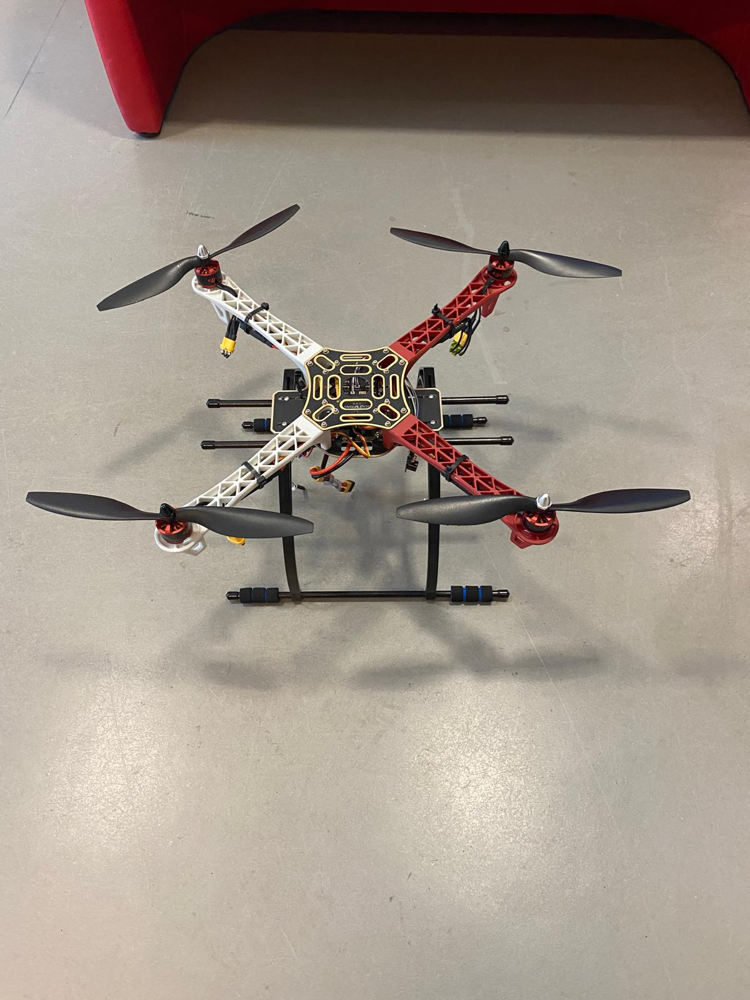

# Drone Autonome avec Perception 3D — ROBO4

## 🖼️ Aperçu

<p align="center">
  
  
</p>
 
Projet de drone quadrirotor autonome capable de naviguer sans GPS en environnement intérieur, avec cartographie 3D en temps réel via SLAM visuel.
 
**Auteurs :** Aziz Zouari & Tarek Abdrabo  
**Module :** ROBO4 — Projet Robotique  
**Année :** 2025 / 2026
 
---
 
## Description
 
L'objectif est d'équiper un drone d'une capacité de localisation et de cartographie simultanées (SLAM visuel) via une caméra RGB-D Intel RealSense D435. Les données sont traitées par une Jetson Nano embarquée qui pilote le contrôleur de vol Pixhawk via le protocole MAVLink/uXRCE-DDS.
 
Le flux de traitement est le suivant :
 
```
RealSense D435 → Jetson Nano (ROS 2 + RTAB-Map) → Pixhawk (PX4) → ESC + Moteurs
```
 
---
 
## Matériel
 
| Composant | Rôle |
|---|---|
| Châssis DJI F450 | Structure mécanique quadrirotor (empattement 450 mm) |
| 4× Moteurs Brushless (1920 KV) | Propulsion, commandés via PWM |
| 4× ESCs | Conversion des signaux PWM en puissance moteur |
| Pixhawk 2.4.8 | Flight controller, firmware PX4, gère la stabilisation (IMU, baromètre) |
| Intel RealSense D435 | Caméra RGB-D stéréo, 640×480 px, interface USB 3.0 |
| Jetson Nano (NVIDIA) | Calculateur embarqué, exécute ROS 2 + RTAB-Map |
| Batterie LiPo 3S (12,6 V) | Alimentation principale |
| Radio commande (Spektrum) | Contrôle manuel via protocole SBUS |
 
---
 
## Stack logicielle
 
- **PX4** — firmware open-source pour le contrôle de vol bas niveau
- **ROS 2 Humble** — middleware de communication entre les nœuds de perception et de contrôle
- **RTAB-Map** — SLAM visuel pour la cartographie 3D dense
- **Gazebo** — simulation physique pour tester les algorithmes avant le vol réel
- **Micro XRCE-DDS** — bridge de communication entre PX4 (uORB) et ROS 2 (DDS)
 
---
 
## État d'avancement
 
| Étape | Statut |
|---|---|
| Assemblage mécanique et électronique | ✅ Terminé |
| Configuration Pixhawk + firmware PX4 | ✅ Terminé |
| Bridge uXRCE-DDS PX4 ↔ ROS 2 | ✅ Terminé |
| Acquisition RealSense D435 sous ROS 2 | ✅ Terminé |
| SLAM visuel RTAB-Map (tests statiques) | ✅ Validé |
| Test de vol manuel | 🔄 En cours |
| Navigation autonome en boucle fermée | 🔄 En cours |
 
## Références
 
- [PX4 Autopilot](https://px4.io)
- [ROS 2 Humble](https://docs.ros.org/en/humble/)
- [RTAB-Map](https://introlab.github.io/rtabmap/)
- [Intel RealSense D435](https://www.intel.com/content/www/us/en/support/articles/000028662)
- [Micro XRCE-DDS — eProsima](https://micro-xrce-dds.docs.eprosima.com)
- [realsense-ros](https://github.com/IntelRealSense/realsense-ros)
 
---
 
*Projet réalisé dans le cadre du module ROBO4 — 2025/2026*
