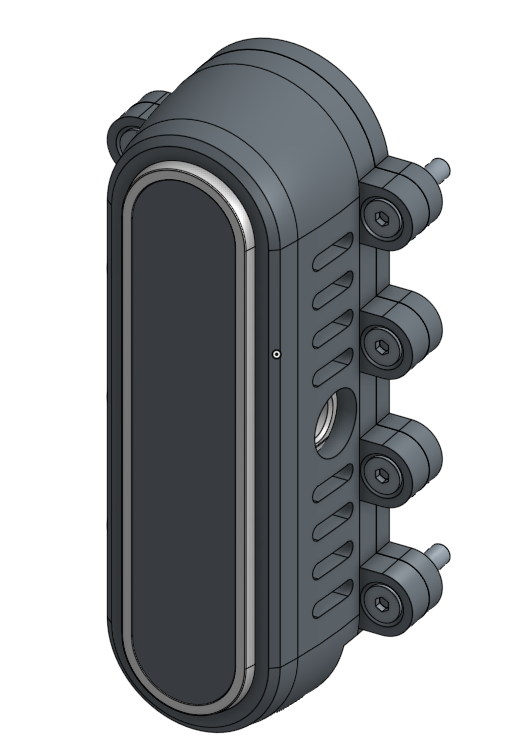
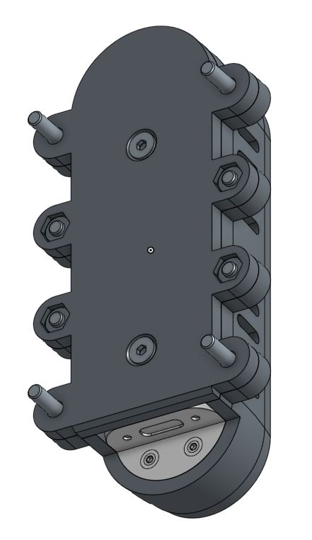
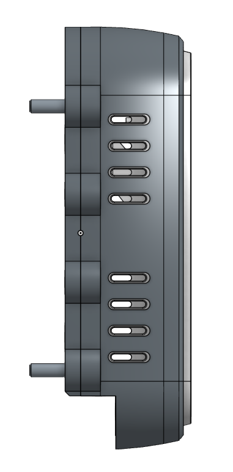

# 📷 Support de caméra du drone

Ce dossier contient le modèle CAO du support utilisé pour maintenir la caméra en place sur le drone.

## 📁 Fichiers

* `camera_mount.step` → Modèle modifiable (format CAO universel)
* `camera_mount.stl` → Fichier pour impression 3D

## 🖼️ Aperçu

  
  
  

## ⚙️ Remarques

* Le fichier `.STEP` est recommandé pour toute modification
* Le fichier `.STL` est prêt pour l'impression 3D
---

